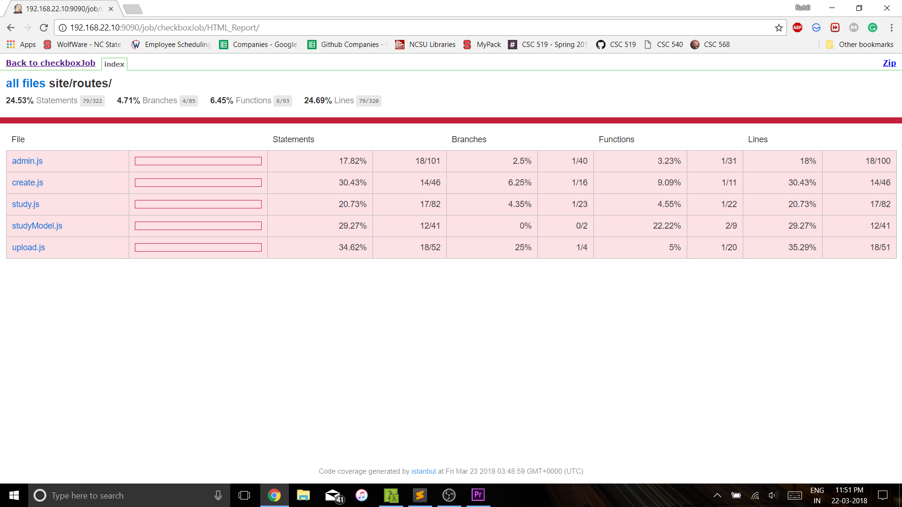

### Coverage/Jenkins Support
To report the code coverage of iTrust, we used a plugin in Jenkins called JaCoCo. iTrust by default, on running the command ```mvn clean test verify checkstyle:checkstyle``` generates a jacoco-ut.exec file which is imported by the JaCoCo plugin and displays a window which displays the code coverage of all the test cases. Below is an image of what the output of the JaCoCo window looks like: 


### Automated Commit Generation - Commit Fuzzer
The fuzzing pipeline goes as follows:
1. Fuzz the source code ([fuzzing.js](https://github.ncsu.edu/rshah8/DevOps-Project/raw/m2/roles/iTrust-fuzzing/files/fuzzing.js)).
2. Commit the fuzzed files.
3. Build the job using a post-commit hook([post-commit](https://github.ncsu.edu/rshah8/DevOps-Project/raw/m2/roles/iTrust-fuzzing/templates/post-commit)).
4. Copy the surefire-reports folder for each build (using [copyReport.js](https://github.ncsu.edu/rshah8/DevOps-Project/raw/m2/roles/iTrust-fuzzing/templates/copyReport.js)) and save it in another folder with the build number so that we can run the test prioritization code after all fuzzing jobs are built.
4. Revert the committed changes.

It takes a directory path and randomly selects a sample list of files, and modifies them. As part of the fuzzing, we created random changes in the file by following the given fuzzing operations:

1. change content of "strings" in code ( with a random string of 10 characters )
2. swap "<" with ">"
3. swap "==" with "!="
4. swap 0 with 1
5. any operation you can think of (here we swapped "&&" with "||")

Basically, the fuzzer tests the effectiveness of testing, rather the test cases. Fuzzing enables us to determine those test cases that do not thoroughly test the source code by virtue of passing or failing each time, even on fuzzing the source code. These test cases can be deemed as ineffective as they are unaffected by the fuzzing. Thus, the fuzzer can help to detect useless test cases.  

Based on the 100 fuzzer commits and 100 build jobs, here is what the jUnit test results look like:   
  

Just looking at the failures per job, we have the following report:  
  


### Test Prioritization Analysis
We analyzed the reports of our test cases and generated a report.md file (using [testPrioritization.js](https://github.ncsu.edu/rshah8/DevOps-Project/raw/m2/roles/iTrust-fuzzing/files/testPrioritization.js)) that displayed the test cases in which we sorted the test cases based on the status of the test case and the average time required for the test case execution. The first criteria for sorting the test cases is the number of times the test case failed, and the next criteria is the the average time required for the test case execution. The average time required for the test case execution is calculated over the 100 builds that we performed.   
* The test cases that fail each time or never fail for each of the 100 builds could be improved.  
* Thus, the test cases in the bottom part of the test report i.e. those which never failed are sufficiently resilient.  
* The failing test cases at the top of report are those that the developer needs to ensure that the application could be modified to handle these test cases.  
* However, a test case failing all the time could also be deemed as faulty.  


### Automated Test Generation
For generating test cases to test the routes in server.js of checkbox.io server-side code, we have used the following modules:
* mongo-mock - To mock mongodb calls.
* mongodb prototypes - To define prototypes to which mongo-mock will intercept calls.
* Istanbul middleware - To hook into the app server to cover internal api resource functions.
* Sinon - To stub the connect method from mongodb and to parse the mongo-mocks mocked db object into the app server.

Program flow:

1. We run ```node main.js``` to parse the files in `/routes/` folder using esprima and getting all the objects that are dependent on the API calls.
2. Post esprima parsing, main.js internally runs `testgenerator.js` which internally runs `mocker.js`
3. We then have mocker.js which contains **mongomock** along with stubs to mongodb prototypes, which will return mock objects in response to actual db connections and queries made in the app server.
4. We then load `cov_server.js` inside mocker.js to run the mock server at a different port(4004) than the actual app server(3002). This coverage-server has code to allow **istanbul-middleware** to be hooked into the real app server. Once the istanbul-middleware is set up, we run the app server to allow the APIs to be called and the coverage to be recorded.
5. Lastly, coming back from server.js --> cov_server.js --> mocker.js --> testgenerator.js, the test generator then generates all the API calls according to the esprima results and exits out to main.js, returning a `test.js` having all the test cases generated for execution.
6. Now we run ```node test.js``` which runs all the required test cases generating reports at `localhost:9090/coverage`.

Integration with Jenkins:

We have also integrated the test generation on Jenkins. The cov_server.js using istanbul-middleware, creates reports on the URI `/coverage/`. We download these reports and add them to Jenkins using HTML publisher Jenkins plugin.

Problems faced:   
A lot of effort was spent in identifying the right API and the approach to mock the mongo db database.  
We experimented with several modules to look for an elegant appraoch.  
We tried the following appraoches:  
* MongoDB prototype methods with Sinon Stubs. We used Sinon mock and stub methods to override the Collection methods from mongodb. While this approach gave us good results, it was not scalable.  
* We also tried creating test data using a local mongodb server, but look towards mocking again since it was more elegant.  
* Finally, we used a combination of mongo-mock, mongodb and a Sinon stubs and mocks to achieve the desired result.  
We ran into issues with the esprima code while we aimed at creating the input test data automatically. The approach would have theoretically produced a higher test coverage than that of what we have currently.


Test Coverage Results:


